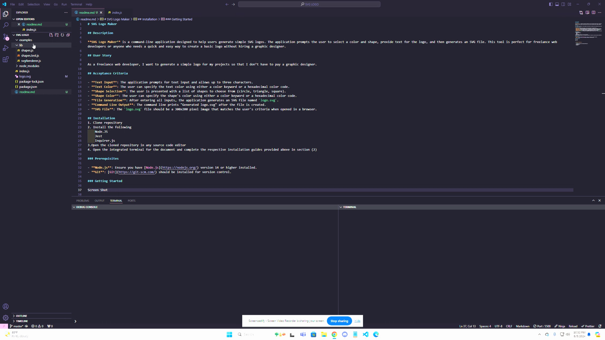
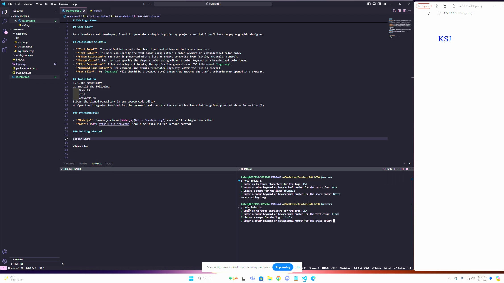

# SVG Logo Maker

## Description

**SVG Logo Maker** is a command-line application designed to help users generate simple SVG logos. The application prompts the user to select a color and shape, provide text for the logo, and then generates an SVG file. This tool is perfect for freelance web developers or anyone who needs a quick and easy way to create a basic logo without hiring a graphic designer.

## User Story

As a freelance web developer, I want to generate a simple logo for my projects so that I don’t have to pay a graphic designer.

## Acceptance Criteria

- **Text Input**: The application prompts for text input and allows up to three characters.
- **Text Color**: The user can specify the text color using either a color keyword or a hexadecimal color code.
- **Shape Selection**: The user is presented with a list of shapes to choose from (circle, triangle, square).
- **Shape Color**: The user can specify the shape's color using either a color keyword or a hexadecimal color code.
- **File Generation**: After entering all inputs, the application generates an SVG file named `logo.svg`.
- **Command Line Output**: The command line prints "Generated logo.svg" after the file is created.
- **SVG File**: The `logo.svg` file should be a 300x200 pixel image that matches the user's criteria when opened in a browser.

## Installation
1. Clone repository https://github.com/Ksjames22/SVGlogo.git
2. Install the following
    Node.JS
    Jest
    Inquirer.js
3.Open the cloned repository in any source code editor
4. Open the integrated terminal for the document and complete the respective installation guides provided above in section (2)

### Prerequisites

- **Node.js**: Ensure you have [Node.js](https://nodejs.org/) version 14 or higher installed.
- **Git**: [Git](https://git-scm.com/) should be installed for version control.

### Getting Started

Screen Shot  

Video Link https://drive.google.com/file/d/1r0eFpzKNLwXpPC3iJQWvCcaeSsjYU2Gs/view?usp=sharing


1. **Clone the repository:**

   ```bash
   git clone https://github.com/Ksjames22/SVGlogo.git
   cd svg-logo-maker
   npm install
   node index.

